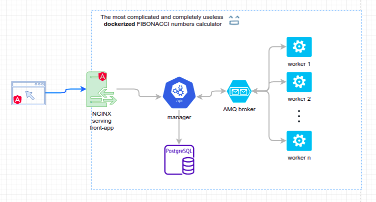

# Dockerized FIBONACCI app


## Setting database before running the application
1. Run services
```
docker-compose -f docker-compose-services.yml up -d
```
2. Create database
```
docker exec fibonacci-postgres sh -c 'psql -U "$POSTGRES_USER" -c "create database task_manager"'
```
3. Stop services
```
docker-compose -f docker-compose-services.yml down
```
The persistent data will be stored locally in `../storage/` directory


## To run the application
`docker-compose up -d` then browse http://localhost:8180 and enjoy ;)

## To scale fib-workers
```
docker-compose up -d --scale fibworker={number-of-instances}
```

## To build all services
```
docker-compose -f docker-compose-build.yml build
```